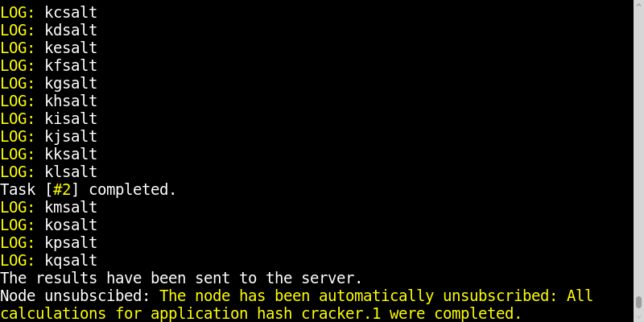

.. _quickstart:

.. module:: kaylee

Running the demo application
============================

Eager to get started?  This page explains how-to start Kaylee demo.
This assumes you already have Kaylee installed.
If you do not, head over to the :ref:`installation` section.

Kaylee is designed to easily interact with any Python web framework.
Out of the box Kaylee contains extensions for
`Flask <http://flask.pocoo.org/>`_ and `Django <http://djangoproject.com/>`_
frameworks.
To start the demo run `src/bin/run.py` from the package and open
the browser with the corresponding address and port (e.g. the address
for the default Flask built-in is http://127.0.0.1:5000).

If everything was successful you should see a page with a black rectangle
in the middle which represents an "echo" console. Don't worry, it's part
of the demo, not Kaylee in general. In few seconds something weird will
happen and at last you will see something like this:

Congratulations! You've just cracked a salted MD5 hash.
If you scroll the console on the web page
to the top, you'll see the steps of project's initialization process.
Finally, check out the shell, you may notice a message from Kaylee
which says what the cracked hash key was::

  * Running on http://127.0.0.1:5000/
  * Restarting with reloader
  127.0.0.1 - "GET / HTTP/1.1" 200 -
  127.0.0.1 - "GET /static/css/all.css HTTP/1.1" 200 -
  127.0.0.1 - "GET /static/js/lib/jquery.min.js HTTP/1.1" 200 -
  127.0.0.1 - "GET /static/js/kaylee/kaylee.js HTTP/1.1" 200 -
  127.0.0.1 - "GET /static/js/kaylee/klconsole.js HTTP/1.1" 200 -
  127.0.0.1 - "GET /static/js/kaylee/kldemo.js HTTP/1.1" 200 -
  127.0.0.1 - "GET /kaylee/register HTTP/1.1" 200 -
  127.0.0.1 - "POST /kaylee/apps/hash_cracker.1/subscribe/500315e30000f528764d HTTP/1.1" 200 -
  127.0.0.1 - "GET /kaylee/actions/500315e30000f528764d HTTP/1.1" 200 -
  127.0.0.1 - "POST /kaylee/actions/500315e30000f528764d HTTP/1.1" 200 -
  127.0.0.1 - "POST /kaylee/actions/500315e30000f528764d HTTP/1.1" 200 -
  The cracked hash key is: kl
  127.0.0.1 - "POST /kaylee/actions/500315e30000f528764d HTTP/1.1" 200 -

It is time to find out, how the heck does Kaylee work.

