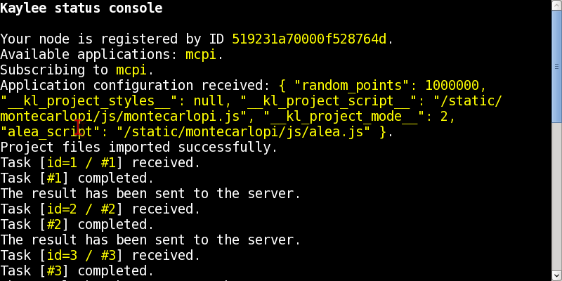

.. _tutorial-building-and-running:

Step 6: Building and Running
============================

You are now ready to build and run the tutorial application.
To build the application run ``klmanage.py`` from ``myenv`` as follows:

.. code-block:: none

  $ python klmanage.py build

This builds the project and copies all the files required to run
the application into the ``_build`` directory.
If the build was successful, run the debug server as follows:

.. code-block:: none

  $ python klmanage.py run

This starts Kaylee on a debug web server (built-in Werkzeug_ web server)
on port 5000.

To run the MonteCarloPi, open a browser at http://127.0.0.1:5000

Do you see something similar to the picture below?

If yes, check the shell, the value of PI should probably be there::

  The value of PI computed by the Monte-Carlo method is: 3.1409588

Do you wonder how come these calculations were distributed?
Well, they weren't, because there was only one node participating.
Try increasing the amount of tasks and then launch the calculations in two
browser tabs or even two different browsers. That's when the calculations
will be truly distributed.

P.S. Remeber, the full source code of the tutorial application is located
in the following repository: http://github.com/BasicWolf/kaylee-demo-projects

.. _Werkzeug: http://werkzeug.pocoo.org/
