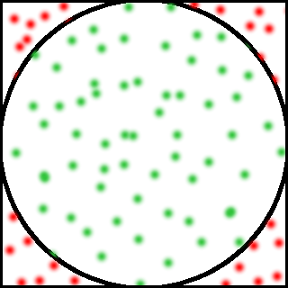
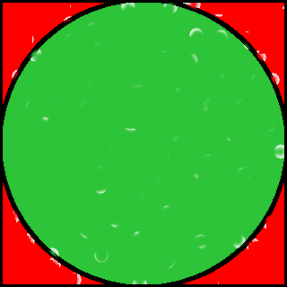

.. _tutorial-introduction:

Introducing MonteCarloPI
========================

Monte Carlo methods (or Monte Carlo experiments) are a class of computational
algorithms that rely on repeated random sampling to compute their results.
How is it possible to compute the value of PI with such algorithm?
Imagine a circle inscribed into a square with the side size of 1.
Thus, the ratio of the area of the square to the area of the circle is:

.. math::
  :label: firsteq

  \frac{S_{\mathrm{square}}}{S_{\mathrm{circle}}} =
  \frac{1 \cdot 1}{\pi \cdot r^2 } =
  \frac{1 \cdot 1}{\pi \cdot 0.5^2 } =
  \frac{4}{\pi}

The value of PI can be derived as follows:

.. math::
  \pi = 4 \frac{S_{\mathrm{circle}}}{S_{\mathrm{square}}}

Let's fill the square with a small amount of random x and y coordinate points:

The green points are those inside the circle, and the red ones are outside.
Imagine filling the same square with millions or even billions of points.
The picture becomes:

The green points have covered almost all the area of the circle and all
points together have covered the while area of the square. The equation
:eq:`firsteq` can now be approximated as follows:

.. math::
  \pi = 4 \frac{{\mathrm{Number\ of\ points\ in\ the\ circle}}}
               {{\mathrm{Total\ number\ of\ points}}}

The equation leads to an idea that the bigger the number of the
generated random points is the better is the approximation of PI.
That is the reason why distributed computation can be used to find
the value of PI: if one node generates 10 million random random points
in a second then ten nodes would generate billion random numbers just in
10 seconds!

Of course that can be done on your own computer! But this is just a small
problem enough to learn building distributed Kaylee apps :)

Continue with :ref:`tutorial-requirements`.
