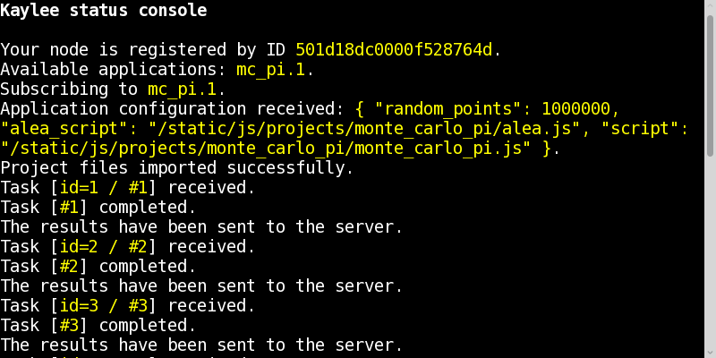

.. _tutorial-running:

Step 7: Running the Application
===============================

Running the Application
-----------------------

If everything was configured and compiled properly, you should be able
to run the MonteCarloPi application as follows:

Run ``python demo/run.py`` and open http://127.0.0.1:5000.

Do you see something similar to the picture below?

If yes, check the shell, the value of PI should probably be there::

  The value of PI computed by the Monte-Carlo method is: 3.1409588

Do you wonder how come these calculations were distributed?
Well, they weren't. But that's because there was only one node participating.
Try increasing the amount of tasks and then launch the calculations in two
browser tabs or even two different browsers. That's when the calculations
will be truly distributed.

P.S. Remeber, the full source code of the tutorial application is located
in the following repository: http://github.com/BasicWolf/kaylee-tutorial-app
