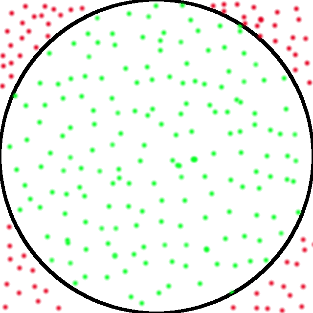

.. _tutorial-introduction:

Introducing MonteCarloPI
========================

Monte Carlo methods (or Monte Carlo experiments) are a class of computational
algorithms that rely on repeated random sampling to compute their results.
Imagine a circle inscribed into a square with the side size of 1. 
Thus, the ratio of the area of the square to the are of the circle is:

.. math::
  \frac{S_{\mathrm{square}}}{S_{\mathrm{circle}}} = 
  \frac{1 \cdot 1}{\pi \cdot 0.5^2 } = \frac{4}{\pi}

And we can derive the value of PI as follows:

.. math::
  \pi = 4 \frac{S_{\mathrm{circle}}}{S_{\mathrm{square}}}

