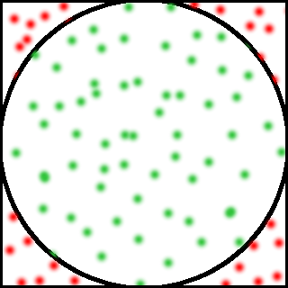
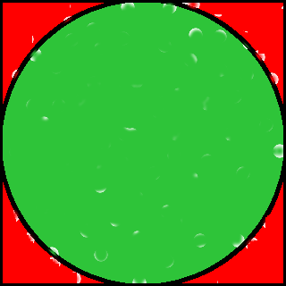

.. _tutorial-introduction:

Introducing MonteCarloPI
========================

Monte Carlo methods (or Monte Carlo experiments) are a class of computational
algorithms that rely on repeated random sampling to compute their results.
How the heck is it possible to compute the value of PI with such algorithm?
Imagine a circle inscribed into a square with the side size of 1.
Thus, the ratio of the area of the square to the are of the circle is:

.. math::
  :label: firsteq

  \frac{S_{\mathrm{square}}}{S_{\mathrm{circle}}} =
  \frac{1 \cdot 1}{\pi \cdot r^2 } = \frac{4}{\pi} =
  \frac{1 \cdot 1}{\pi \cdot 0.5^2 } = \frac{4}{\pi}

And we can derive the value of PI as follows:

.. math::
  \pi = 4 \frac{S_{\mathrm{circle}}}{S_{\mathrm{square}}}

Let's fill the square with a small amount of random x and y coordinate points:

The green points are inside the circle, but on the picture there
isn't that many of them. Imagine if have filled the square with millions
or even a billion of points. The picture above becomes:

You may have noticed that the green points have covered almost all the area
of the circle and all points together have covered the are of the square.
We can now approximate equation :eq:`firsteq` as follows:

.. math::
  \pi = 4 \frac{{\mathrm{Number\ of\ points\ in\ circle}}}
               {{\mathrm{Total\ number\ of\ points}}}

From this equation we can also state that the bigger is the number of
generated random points the better is the approximation of PI.
And it is the reason we would like to use distributed computation to find
the value of PI: if one node generates e.g. 10 million random random points
in a seconds then ten nodes can generate billion random numbers in just
10 seconds!

Of course, you can do that on your own computer! But hey, this is just a task
small enough to easily learn how-to build Kaylee apps. Are you ready?
Continue with :ref:`tutorial-project-structure`.

