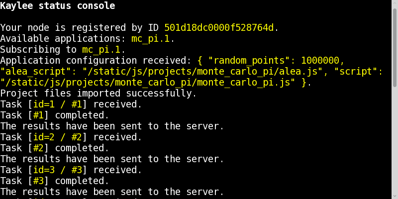

.. _tutorial-running:

Step 5: Compiling and Running the Application
=============================================

Makefile
--------

The Makefile builds ``monte_carlo_pi.js`` and (if remote target is available)
copies to to the remote location.::

  PROJECT_NAME = monte_carlo_pi
  LIB = $(PROJECT_NAME).js
  # location of coffee file and to-be-compiled js files.
  LIBDIR = js

  # js target
  TARGETS = $(LIBDIR)/$(LIB)
  CLEAN_TARGETS =

  # if make has been called recursively, add remote targets
  ifeq ($(origin PJ_RES_DIR), environment)
  TARGETS += remote
  CLEAN_TARGETS += clean_remote
  endif

  all: $(TARGETS)

  $(LIBDIR)/$(LIB): $(LIBDIR)/$(PROJECT_NAME).coffee
  	  coffee --bare -c $(LIBDIR)/$(PROJECT_NAME).coffee

  remote:
      mkdir -p  $(PJ_RES_DIR)/$(PROJECT_NAME)
  	  cp $(LIBDIR)/*.js $(PJ_RES_DIR)/$(PROJECT_NAME)

  clean: $(CLEAN_TARGETS)
  	  rm -f $(LIBDIR)/$(PROJECT_NAME).js

  clean_remote:
  	  rm -rf $(PJ_RES_DIR)/$(PROJECT_NAME)

Now you can simply run ``make`` in project's directory to build it locally or
in Kaylee's  ``src/`` directory to build the projects and gather the files to
the remote location defined in ``src/Makefile``

Running the Application
-----------------------

If everything was configured properly, you should be able to run the
MonteCarloPi application the same way as the demo:
run ``python src/bin/run.py`` from the package and open
the browser with the corresponding address and port (e.g. the default
address of Flask is http://127.0.0.1:5000).

Do you see something as in the picture below?

If yes, check the shell, the value of PI should probably be there::

  The  value of PI computed by the Monte-Carlo method is: 3.1409588

Do you wonder how the heck these calculations were distributed?
Well, they were, but we had only one node participating. Try increasing the
amount of tasks and then launch the calculations in two browser tabs or
even two different browsers. That's when the calculations will be truly
distributed.
